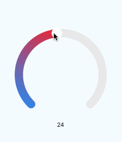

# rn-circular-slider

React Native circular slider based on [react-native-svg](https://github.com/react-native-community/react-native-svg)

<div align=center></div>

## Installation

Install the `rn-circular-slider` package in your React Native project.

```bash
$ yarn add rn-circular-slider
```

Next, install [react-native-svg](https://github.com/react-native-community/react-native-svg)

```bash
$ yarn add react-native-svg
$ react-native link react-native-svg
```

## Usage

```js
/**
 * Sample React Native App
 * https://github.com/facebook/react-native
 *
 * @format
 * @flow
 */

import React, { Component } from 'react';
import { StyleSheet, View, Text } from 'react-native';

import CircularSlider from 'rn-circular-slider'

console.disableYellowBox = true

export default class App extends Component {
  state = {
    value: 0
  }

  render() {
    const { value } = this.state
    return (
      <View style={styles.container}>
        <CircularSlider
          min={0}
          max={50}
          value={value}
          onChange={value => this.setState({ value })}
        />
        <Text>{value}</Text>
      </View>
    );
  }
}

const styles = StyleSheet.create({
  container: {
    flex: 1,
    justifyContent: 'center',
    alignItems: 'center',
    backgroundColor: '#F5FCFF',
  }
});

```